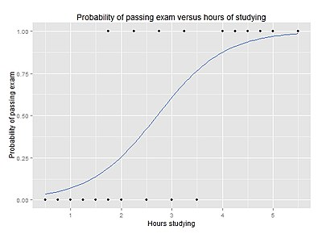
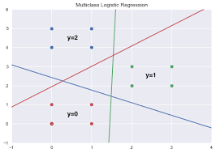

# Logistic Regression + PCA

The ultimate goal of this project is to **compare** using **runtime** and **accuracy** the effectiness of using a dimensionality reduction technique called Principal Component Analysis (PCA) to reduce the workload of a certain algorithm, in this case a Logistic Regression.

For that, well use a well known dataset for training and testing, the **MNIST Database of Handwritten Digits**.

>MNIST is a dataset that consists of **785 columns**, one  of them being the *label* (the digit that is in the image) and the rest of them being *each pixel* of the **28x28** image.

## Logistic Regression

Logistic Regression are widely used in classification problems, most commonly known for being used to solve **binary** classification problems, as shown below.

>
>##### Font: https://en.wikipedia.org/wiki/Logistic_regression

But in this case, as explained above, we have more than 2 possible labels (10 to be accurate), therefore we are going to use a **Multinomial Logistic Regression**. It works on the same concepts of a regular Logistic Regression but applied to categorical values instead of binaries.

>
>##### Font: https://machinelearningmedium.com/2017/09/06/multiclass-logistic-regression/

## PCA

Principal Component Analysis is a **Dimensionality Reduction** technique, that means it aims to reduce the number of dimensions in a given dataset, dimensions are the number of features we are working on that dataset, in our case each pixel is one dimension, therefore we have 784 dimensions.

PCA achieves its goal by **transforming** the data in such a way that **most of the variance** will be retained in the **minimum number of components**, it will remain with the original number of components, but different components, with different values.

After that it selects the most relevant components of the data, the **higher the variance** one component has, the **more relevant** it will be. And how does PCA knows the number of components to select? Simple, it doesn't, you have to give it a number, either the **percentage of the variance** or the **number of components** you want to retain.